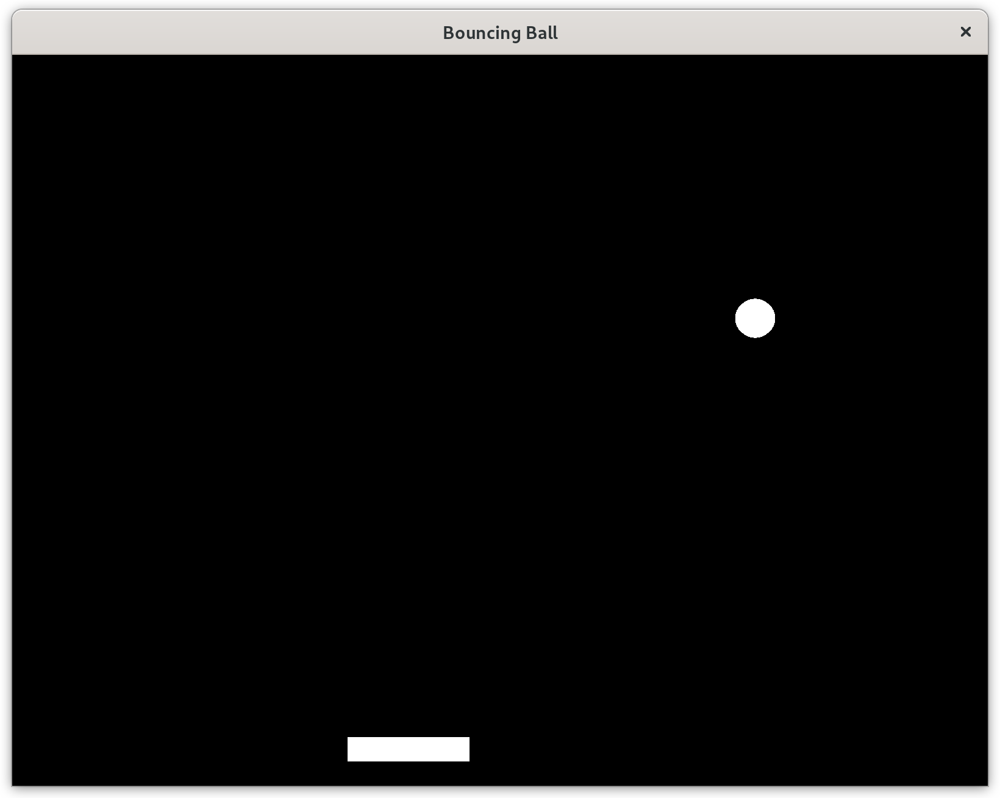

# Introduction

Demonstration of a simple bat and ball game using Rust and SDL2.

This was an experiment with a Model View Controller (MVC) pattern for GUI development, where there is also a requirement for mutable state.
Modern GUI frameworks (such as Elm) are functional, with immutable state, whereas games typically require mutable state for performance reasons.

The reuseable code has been split out into a separate library that new applications can use.
The game-specific code is separate and consists of implementing the required library specified MVC traits and calling the initialisation and dispatcher functions.

The GUI is displayed using SDL2 which is a well-known low level interface, often used for cross-platform (MS Windows, Linux) games that require a graphical GUI.
One issue is the difficulty of making an interface with a smooth framerate.
This was fixed in this game by using low-level keystroke processing and careful use of timing to decide when to update the display.

# Linux Installation

The following works on Fedora. The library names are probably different for non-Fedora based distributions.

    ./install_sdl2_fedora34.sh

or:

    dnf install -y SDL2-devel
    dnf install -y SDL2_image-devel
    dnf install -y SDL2_gfx-devel
    dnf install -y SDL2_mixer-devel
    dnf install -y SDL2_ttf-devel  

The following works on Ubuntu:

    apt-get update
    apt-get install libsdl2-dev
    apt-get install libsdl2-image-dev
    apt-get install libsdl2-gfx-dev
    apt-get install libsdl2-mixer-dev
    apt-get install libsdl2-ttf-dev

# License

MIT
